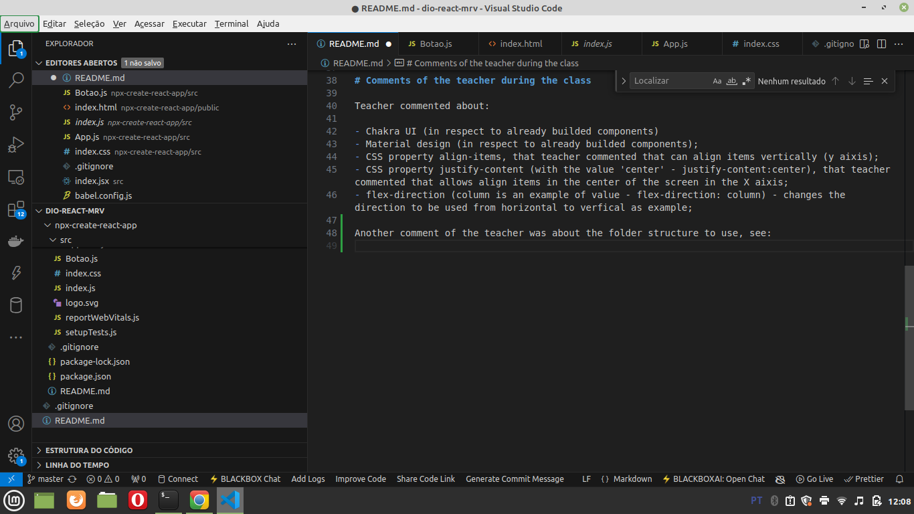
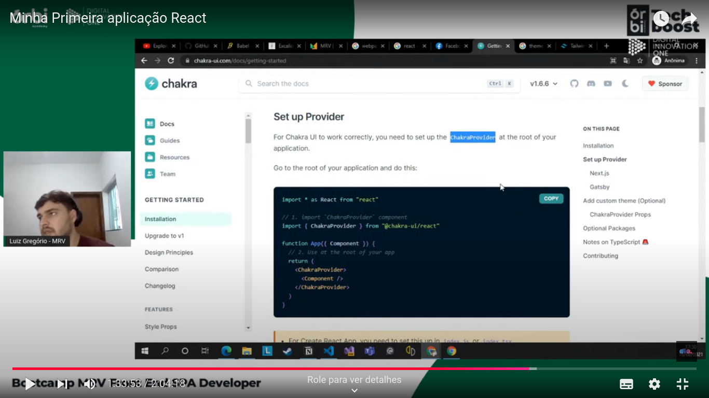
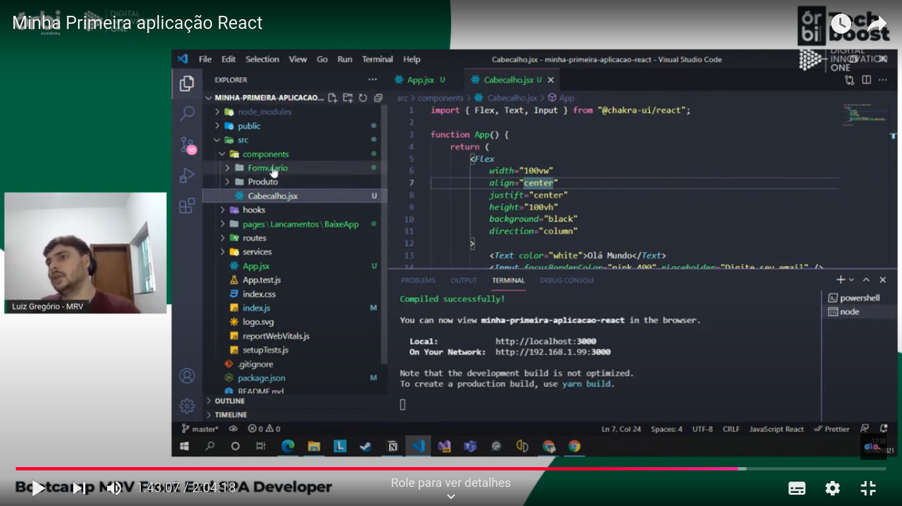
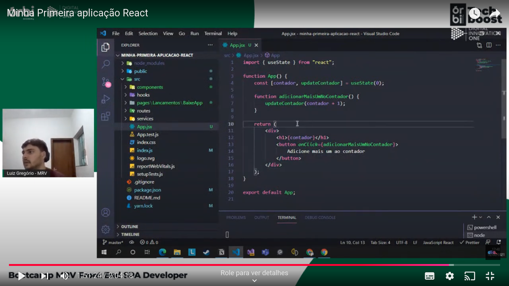

# General

Commands used so to install packages:

```
npm install react
npm install react-dom
yarn add @babel/core @babel/cli @babel/preset-env -D
yarn add @babel/preset-react -D
```

In the last command, -D is to set the dependencies as devDependencies.


# Converting with Babel in the terminal

Ads we installed **@babel/cli**, we can use the following command to convert our code in the terminal:

```
<application-root>/node_modules/bin/babel <input> <output>
```


# Generating bundle.js

We generated the file **bundle.js** with the following command:

```
yarn babel src/index.jsx --out-file dist/bundle.js
```


# Creating a 'manual' folder and a folder with the content generated with the command 'npx create-react-app'

I created a folder and moved the previous created files and directories (except README.md, .git and .gitignore) to this folder. Then I created a new React app with the command 'npx create-react-app'.


# Comments of the teacher during the class

Teacher commented about:

- Chakra UI (in respect to already builded components)
- Material design (in respect to already builded components);
- CSS property align-items, that teacher commented that can align items vertically (y aixis);
- CSS property justify-content (with the value 'center' - justify-content:center), that teacher commented that allows align items in the center of the screen in the X aixis;
- flex-direction (column is an example of value - flex-direction: column) - changes the direction to be used from horizontal to verfical as example;

Another comment of the teacher was about the folder structure to use, see:



The function of each folder is a little obvious based on its name. In relation to the folder 'services', this folder is related to services, as example external calls of the application.

Teacher commented about ChakraUI and Tailwindcss and commented that all this libraries has a lot of components already builded, and that we can use them in our application. In Tailwindcss website he showed that they have some documentations related specifically to React. He commented that he is using ChrakraUI. He saw in the documentation how to integrate with a React App.



Teacher indicated [this course](https://www.origamid.com/curso/css-flexbox/) about Flexbox.

See how the teacher used the extension **.jsx** to Javascript files with JSX content:



Teacher showed the next exampĺe about using "useState" and a click handler:



As you can see in the image, "contador" is how we get the value of the counter and "updateContator" is how we set the value of the counter"